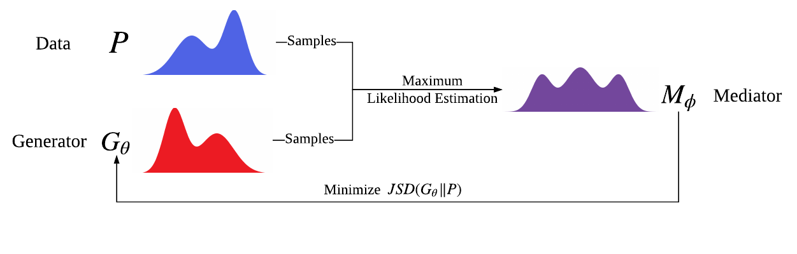

# Cooperative Training
Experiment Code for Paper ``CoT: Cooperative Training for Generative Modeling''


## Requirements
* Python 3.x
* tensorflow >= 1.6.0
## Introduction
We propose a new paradigm of algorithm for training tractable explicit density generative models like RNN language models.

The research paper [CoT: Cooperative Training for Generative Modeling](https://arxiv.org/abs/1804.03782) is now available on arXiv and has been submitted to NIPS 2018 as a conference paper.
## Usage
We reproduce example codes to repeat the synthetic Turing test experiment with evaluations of NLL<sub>test</sub>, NLL<sub>oracle</sub>, balanced NLL and JSD(P || G) by the oracle model.
```
$ python3 cot.py

Start Cooperative Training...
batch:   0      nll_oracle   11.429975
batch:	 0      nll_test     8.524782
cooptrain epoch# 0  jsd      8.365606
batch:   100    nll_oracle   10.475937
batch:	 100    nll_test     7.9382834
cooptrain epoch# 1  jsd      7.330582
batch:   200    nll_oracle   10.38681
batch:	 200    nll_test     7.868909
... ...
```

